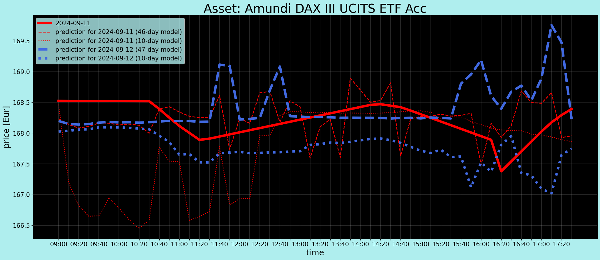

# Asset Price Prognosis DeGiro

### Summary
This project aims to predict the next day's price data for an asset based on its past price evaluation.

### Motivation
The idea is to get a feel for the next day's prices by using two different models on the price data collected.
One model is based on all the daily price data collected, while the other model is based only on the data collected over the last 10 days.
By evaluating both models, one can assess the most likely short-term prediction as well as one that takes into account long-term behaviour.

If the predictions of both models agree, there is a high probability of predicting tomorrow's prices.
The following chart shows a typical result.



### Data sources 
This project requires past price data of a desired asset.
To do so, an API provided in
https://github.com/lolokraus/DegiroAPI/
to access such data from the online broker DeGiro is used within the Jupyter notebook "save_latest_daily_course_of_asset.ipynb".
Hereby, a way to access with two factor authentification is provided at
https://gist.github.com/rkulow/5917485a0a657b31a2b74dd06b15490b

### Acknowledgements
This project acknowledges the following sources and individuals:

1. The creators of the DegiroAPI (https://github.com/lolokraus/DegiroAPI/tree/master/examples) for providing an API to access price data from the online broker DeGiro.
2. Ralf Kulow for sharing a way to access the API with two-factor authentication (https://gist.github.com/rkulow/5917485a0a657b31a2b74dd06b15490b).
3. The contributors to the packages listed in the requirements_working_configuration.txt for their work on the various libraries and tools used in this project.

### Install/run instructions:
1. Install python >= 3.11 and the packages denoted in requirements_working_configuration.txt preferably in a virtual environment as exemplarily shown for the windows command prompt:
```
      projectfolder:> python -m venv .venv
      projectfolder:> cd .venv\Scripts
      projectfolder\.venv\Scripts> .\activate.bat
      projectfolder\.venv\Scripts> cd ..\..
      projectfolder:> python -m pip install -r requirements_working_configuration.txt
```
      Within your project folder "projectfolder" use the "python" command as long as the virtual environment is activated
      (if not working with/on the project, the virtual environment should be deactivated by executing projectfolder\.venv\Scripts\deactivate.bat).

2. In the programming IDE select .venv\Scripts\python.exe as Kernel for the corresponding ipynb-file.

3. Run the desired ipynb-file depending on the usage

### Usage

1. Subsequently build up daily price datasets in folder "data" using for example "save_latest_daily_course_of_asset.ipynb" which connects with your DeGiro account. The account information is stored in user_data.csv as explained in the ipynb-file.
The files for the daily price datasets look like the following example:
<!-- language: lang-none -->
    clock_time,time,course
    0:00:00,0,168.56
    10:31:00,631,168.52
    10:58:00,658,168.14
    11:21:00,681,167.88
    14:16:00,856,168.48
    14:41:00,881,168.42
    16:12:00,972,167.88
    16:20:00,980,167.38
    17:07:00,1027,168.14
    17:29:00,1049,168.4
    17:35:00,1055,168.36
The filenames carry the date (YYYY-MM-DD) and the asset name separated by an underscore.
Example: 2024-09-11_Amundi DAX III UCITS ETF Acc.csv
2. Once enough days have been recorded, run "predict_next_daily_course_of_asset.ipynb".


### Files in the repository
```
.gitignore
data
|-.gitkeep
|-2024-08-07_Amundi DAX III UCITS ETF Acc.csv     # example for a typical file extracted from DeGiro; it is not provided in the repository
|- ...
degiroapi                                         # modified package from https://github.com/lolokraus/DegiroAPI
functions_module.py                               # provides functions for date and time issues
LICENCE                                           # licence file
newplot.png                                       # exaplary pricing diagram of asset: "Amundi DAX III UCITS ETF Acc" with underlying data retrieved from DeGiro broker
predict_next_daily_course_of_asset.ipynb          # script for predicting course data one day ahead of given data
README.md
regressor_module.py                               # specifically designed regressor that takes the absolute shift in pricing into account
requirements.txt                                  # list of required packages
requirements_working_configuration.txt            # list of packages covering a working configuration
save_latest_daily_course_of_asset.ipynb           # script for collecting up to date course data from latest working day
show_portfolio.ipynb                              # script for having a look at the portfolio in DeGiro - it is a nice-to-have file
typical_result.png                                # image file revealing a typical result of a prediction run
```
